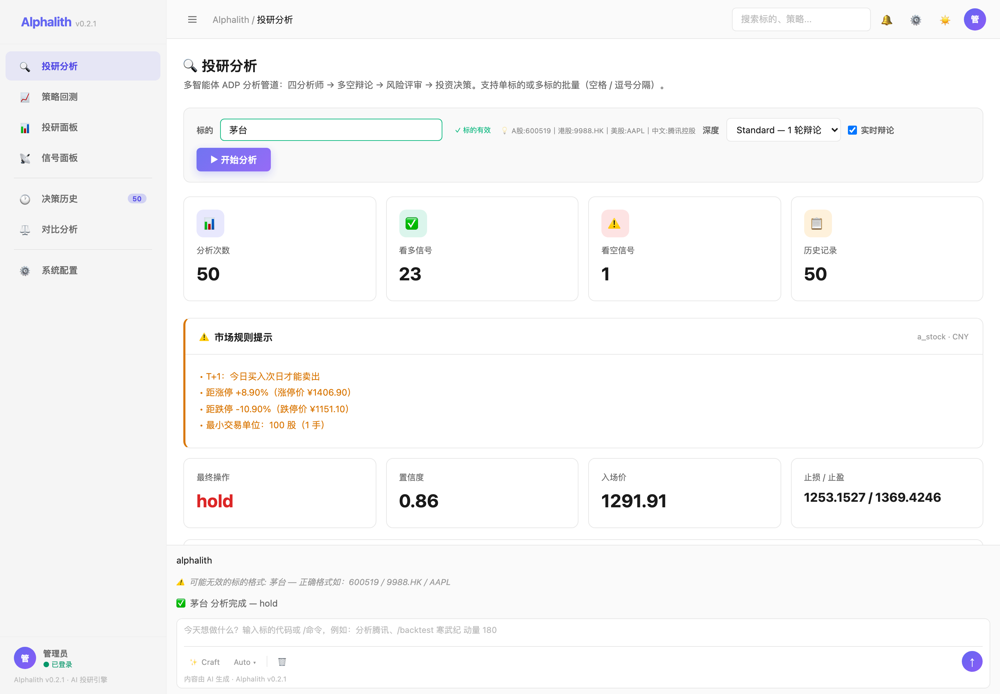
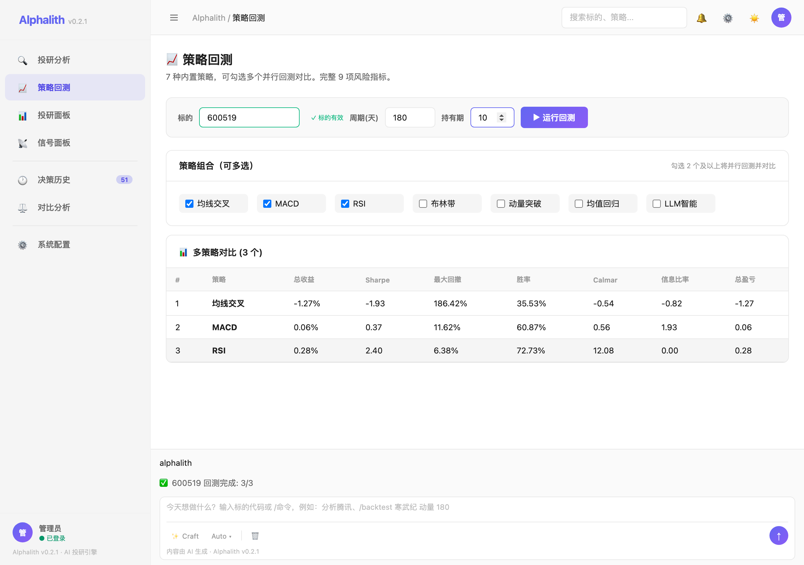
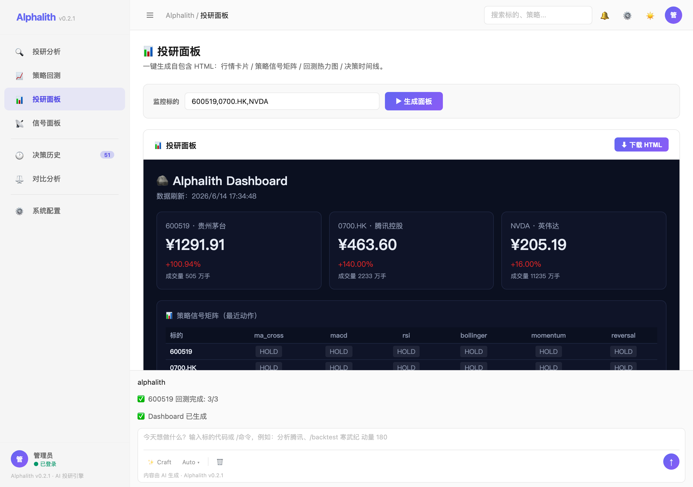

# 🪨 Alphalith · 慧投

> **项目名来源**: *Alphalith* = **Alpha**（超额收益）+ **Lith**（古希腊语 λίθος，"立石/ bedrock"）→ "封存于立石的 Alpha 决策"，与文末铭文 *Sealed in the Bedrock* 呼应。中文名"慧投"= 慧眼投研。
>
> **The Bedrock of AI-Driven Alpha** · AI 慧眼，洞察先机 · v0.2.1
>
> 一个轻量、零外部依赖的多智能体 AI 投研引擎，原生支持 **A 股 / 港股 / 美股**。

---

## ✨ 核心特性

- **零外部依赖**：仅 Python 3.10+ 标准库即可运行（`dependencies = []`）。`pip install` 几秒搞定。
- **三市场原生支持**：🇨🇳 A 股 / 🇭🇰 港股 / 🇺🇸 美股，各市场交易规则完整覆盖（T+1/涨跌停/印花税/每手单位）。
- **4 智能体投研委员会**：技术 / 基本面 / 新闻 / 情绪分析师 + 多空辩论 + 风控复核。
- **真实数据闭环**：行情（新浪 hq.sinajs.cn）、基本面（腾讯 qt.gtimg.cn）、新闻（东财 search-api）。
- **多策略回测引擎**：7 种策略（MA/MACD/RSI/布林带/动量/反转/LLM），14 项风险指标，双策略对比。
- **决策日志**：SQLite 自动落库，支持历史回溯与复盘。
- **ADP v1.0 协议**：决策对象标准化，可 webhook / 跨系统传递。

---

## 🖥️ GUI 投研工作台

零外部依赖，单文件 HTML + Python 内置 HTTP 服务，一键启动：

```bash
pip install -e .
alphalith gui                    # 默认 8888 端口
alphalith gui --port 3000        # 自定义端口
alphalith gui --no-browser       # 仅启动服务
```

打开浏览器即用，无需任何前端构建工具。







### 七大功能页面

| 页面 | 功能亮点 |
|---|---|
| 🏠 **投研分析** | SSE 流式实时辩论（4 分析师 + 多空辩论），进度条追踪分析阶段，ECharts 图表 + 决策卡片 |
| 📈 **策略回测** | 7 策略多选并行回测，14 项风险指标（Sharpe/Sortino/Calmar/信息比率），收益曲线 + 交易明细 |
| 📊 **投研面板** | 一键 Dashboard（行情卡片 + 信号矩阵 + 回测热力图 + 决策时间线），iframe 内嵌展示 |
| 🎯 **信号面板** | 多标的 × 多策略信号汇总（LONG/SHORT/NEUTRAL），批量输入 |
| 📦 **批量分析** | 空格分隔多标的，串行执行 + 实时进度 |
| 📋 **决策历史** | 按标的筛选 + 未读计数 badge，默认加载全部最近记录 |
| 📐 **审查统计** | 买入/卖出/持仓次数 + 胜率 + 平均置信度 |

### 界面特性

- 🌓 **暗黑 / 浅色主题**（CSS 变量驱动，ECharts 自适应重绘）
- 🔐 **安全登录**（PBKDF2-SHA256 加密，Cookie session，默认管理员 admin/alphalith）
- 📡 **SSE 流式输出**（实时推送分析进度 / 分析师报告 / 多空辩论 / 最终决策）
- 🎯 **标的格式校验**（失焦自动校验 A股/港股/美股/中文名，绿✓/红✗ 视觉反馈）
- 🏷️ **供应商列表 Logo**（下拉菜单中每家供应商前附带品牌图标，一目了然）
- 💬 **底部 AI 对话**（支持 /命令 快捷操作）
- 📊 **ECharts 图表**（主题自适应配色，收益曲线 / 净值走势）

### 模型配置：15 家供应商 × 两级联动选择

选择「供应商」→ 自动填入 API Base URL → 选择预设模型 → 或输入自定义模型 ID，三步完成配置。

| 供应商 | 最新模型 | 发布时间 |
|---|---|---|
| 🔥 **DeepSeek** | V4 Pro · V4 Flash | 2026.04 |
| ☁️ **阿里云百炼** | Qwen3.6 Max · Coder Plus · Omni | 2026.05 |
| 🌐 **OpenAI** | GPT-5.5 · GPT-5.6 Preview · o4-mini | 2026.04 |
| 🧠 **Anthropic Claude** | Opus 4.7 · Sonnet 4.6 | 2026.05 |
| ⭐ **Google Gemini** | 3.5 Flash · 3.1 Pro | 2026.06 |
| 🏛️ **智谱 GLM** | GLM-5.2 · Flash | 2026.06.13 🆕 |
| 🌙 **Kimi 月之暗面** | K2.7 Code · K2.6 | 2026.06.12 🆕 |
| 🌋 **火山方舟·豆包** | Pro 256K · Lite 128K | 2026 |
| 📘 **百度千帆** | ERNIE 4.5 · Speed | 2026 |
| 💻 **腾讯 Coding Plan** | Auto / GLM-5 / Kimi K2.5 / MiniMax M2.5 | 2026 |
| 🎫 **腾讯 Token Plan** | Auto / GLM-5.1 / Kimi K2.5 / MiniMax M2.7 | 2026 |
| 🚀 **腾讯 Hy Token Plan** | Hy3 Preview (295B MoE · 256K ctx) | 2026 |
| 🎯 **MiniMax** | MiniMax-M1 | 2026 |
| ⚡ **阶跃星辰** | Step 3.5 Flash | 2026 |
| 🔗 **硅基流动** | DS V4 Pro / Qwen3.6 (国内直连代理) | — |

> 💡 海外供应商（OpenAI / Claude / Gemini）需代理或第三方中转。腾讯 Coding/Token Plan 提供固定月费编程订阅。支持**自定义模型 ID** 输入。

---

## 🐍 Python API

```python
from alphalith import analyze

d = analyze("茅台")            # 自动走真实行情 + LLM
print(d.action, d.confidence)  # 'hold', 0.86
print(d.to_adp_json())         # ADP v1.0 标准 dict
```

---

## 🔧 命令行

完整 CLI 子命令（analyze / backtest / dashboard / history / review / gui）使用说明见 [docs/CLI.md](docs/CLI.md)。

---

## 🗂️ 目录结构

```
alphalith/
├── core.py         # analyze() 主入口
├── market.py       # 三市场识别 + 中文名解析
├── data.py         # 行情/新闻/基本面统一 Provider
├── rules.py        # A/HK/US 三市场规则引擎
├── agents.py       # 4 分析师 + 多空辩论
├── llm.py          # 降级链 + token 计数
├── schema.py       # ADP v1.0 Decision dataclass
├── backtest.py     # 回测引擎（7 策略 + buy&hold 基准 + 风险指标）
├── html_report.py  # HTML 可视化报告
├── journal.py      # SQLite 决策日志
├── report.py       # 中文报告渲染
├── cli.py          # CLI 入口
├── dashboard.py    # Dashboard 面板（行情 + 信号 + 热力图）
├── gui/
│   ├── __init__.py # GUI HTTP 服务
│   └── app.html    # GUI 前端（单文件，CSS/JS 内联）
├── docs/
│   └── CLI.md      # CLI 完整使用手册
└── tests/
```

---

## 📜 协议与致敬

- **ADP v1.0 协议**：见 `../ADP_PROTOCOL_v1.md`
- **致敬**：受 TradingAgents、TradingAgents-CN、TradingView 启发，但核心代码 100% 自研。详见 `../ATTRIBUTION.md`。
- **License**：MIT

---

> 🪨 *Sealed in the Bedrock*
