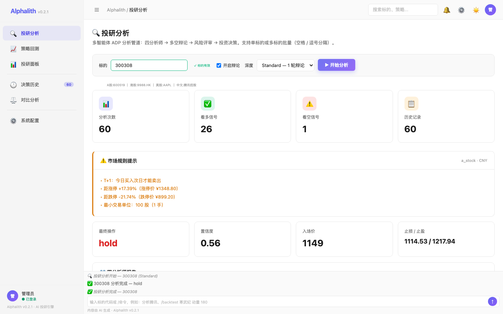
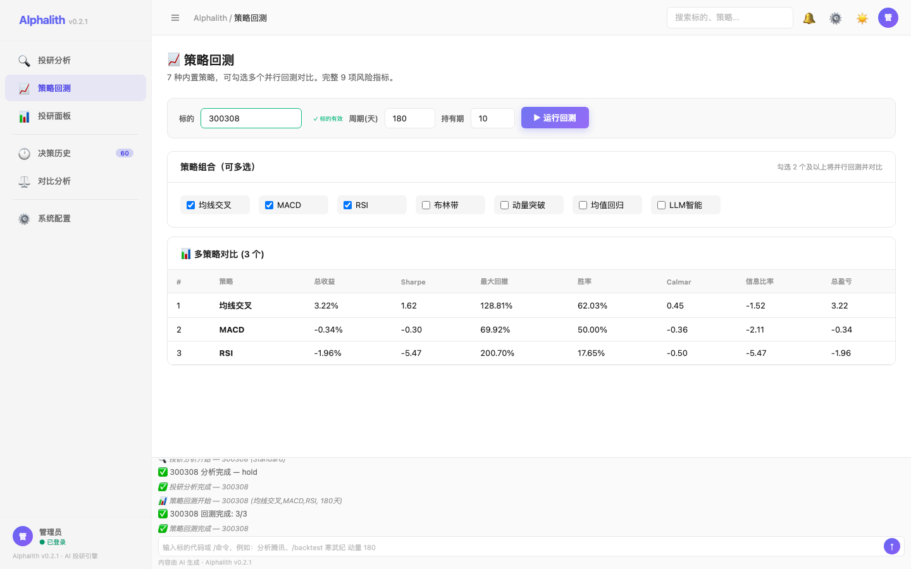
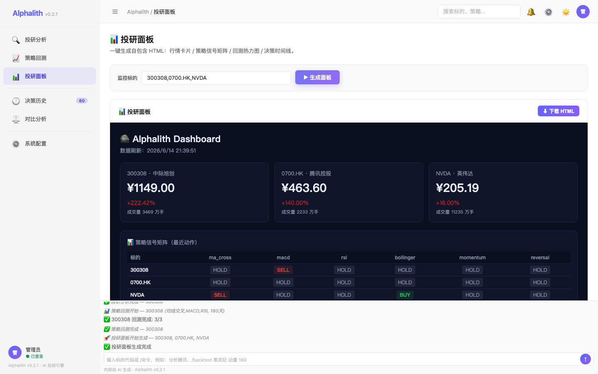

<div align="center">


# Alphalith · 慧投

### 🪨 AI 慧眼，洞察先机

**多智能体 AI 投研委员会 — A 股、港股、美股一站式分析。**

[](https://pypi.org/project/alphalith)
[](https://python.org)
[](LICENSE)
[](https://github.com/alphalith/alphalith)

[English](README.md) · [在线文档](https://alphalith.ai) · [在线演示](https://alphalith.ai/demo)

</div>

---

> **项目名来源**: *Alphalith* = **Alpha**（超额收益）+ **Lith**（古希腊语 λίθος，"立石 / bedrock"）→ "封存于立石的 Alpha 决策"，与文末铭文 *Sealed in the Bedrock* 呼应。中文名"慧投"= 慧眼投研。

> **v0.2.1** · 一个轻量、零外部依赖的多智能体 AI 投研引擎，原生支持 **A 股 / 港股 / 美股**。

> 对冲基金有分析师团队，**现在你也有了。**

**慧投（Alphalith）** 召集一支由技术、基本面、新闻、情绪四位 AI 分析师组成的投研委员会，像真正的投资决策会议那样激辩多空，最终输出可复现、可追溯的交易决策。一条命令，三大市场，普通人也能拥有自己的 AI 投研团队。

---

## ✨ 为什么是慧投

| 痛点 | 慧投的解决方案 |
|------|--------------|
| 现有 AI 量化框架要装 Conda + 配 13 个 API Key + 折腾半小时 | `pip install alphalith`，**30 秒**就能跑 |
| 单一 LLM 分析浅，容易幻觉 | **4 个专业 Agent 多空辩论**后再决策 |
| 单次成本 $0.5+，散户用不起 | 默认 DeepSeek，**单次 < ¥0.07** |
| A 股 / 港股规则（T+1、整手、印花税）没人管 | 内置完整 **市场规则引擎** |
| 国外工具全英文，国内用户用不顺手 | 从第一天起就是 **中英双语** |
| 决策没法落地实盘 | 原生支持 **TradingView Webhook** |

---

## 🏛 投研委员会

```
                ┌──────────────────────────┐
                │  📜 投资组合经理           │  最终封印
                ├──────────────────────────┤
                │  🛡 风控经理               │  审批 / 否决
                ├──────────────────────────┤
                │  💼 交易员                 │  仓位 / 时机
                ├──────────────────────────┤
                │  🐂 多方  ⚔  🐻 空方     │  结构化辩论
                ├──────────────────────────┤
                │  📈 技术 │ 📊 基本面       │
                │  📰 新闻 │ 💬 情绪         │  4 分析师（并行）
                └──────────────────────────┘
```

---

## 🖥 Web GUI（内置）

启动 GUI 工作台 — 零额外依赖：

```bash
alphalith gui          # http://127.0.0.1:8888
alphalith gui --port 28080   # 自定义端口
```

**以下截图均为 Alphalith 在** **中际旭创 (300308)** **上真实运行生成：**

#### 🔍 投研分析

4 位 AI 分析师 → 多轮多空辩论 → 风控评审 → 最终决策。流式实时输出。



#### 📈 策略回测

7 种内置策略，多策略对比表格，含 Sharpe / 最大回撤 / 胜率等指标。



#### 📊 投研面板

多标的监控面板：行情卡片 / 策略信号矩阵 / 回测热力图。可导出自包含 HTML 文件。



### 功能页面

| 页面 | 功能亮点 |
|---|---|
| 🏠 **投研分析** | SSE 流式实时辩论，进度条追踪分析阶段，ECharts 图表 + 决策卡片 |
| 📈 **策略回测** | 7 策略多选并行回测，14 项风险指标（Sharpe/Sortino/Calmar/信息比率），收益曲线 + 交易明细 |
| 📊 **投研面板** | 一键 Dashboard（行情卡片 + 信号矩阵 + 回测热力图 + 决策时间线） |
| 📦 **批量分析** | 空格分隔多标的，串行执行 + 实时进度 |
| 📋 **决策历史** | 按标的筛选 + 未读计数 badge，默认加载全部最近记录 |
| ⚙️ **系统配置** | 15 家供应商列表、数据源管理、账户设置 |

### 界面特性

- 🌓 **暗黑 / 浅色主题**（CSS 变量驱动，ECharts 自适应重绘）
- 🔐 **安全登录**（PBKDF2-SHA256 加密，Cookie session，默认管理员 admin/alphalith）
- 📡 **SSE 流式输出**（实时推送分析进度 / 分析师报告 / 多空辩论 / 最终决策）
- 🎯 **标的格式校验**（失焦自动校验 A股/港股/美股/中文名，绿✓/红✗ 视觉反馈）
- 🏷️ **供应商列表 Logo**（下拉菜单中每家供应商前附带品牌图标，一目了然）
- 💬 **底部 AI 对话**（支持 /analyze /backtest /dashboard /history 等斜杠命令）
- 📊 **ECharts 图表**（主题自适应配色，收益曲线 / 净值走势）

---

## 🚀 30 秒上手

```bash
pip install alphalith
alphalith analyze 中际旭创         # A 股
alphalith analyze 腾讯              # 港股
alphalith analyze 英伟达            # 美股
alphalith analyze 中际旭创 腾讯 英伟达 --compare    # 跨市场对比
```

---

## 💻 Python API

```python
from alphalith import Council

council = Council(language="zh-CN", depth="standard")
decision = council.convene("300308")  # 中际旭创

print(decision.action)            # "buy"
print(decision.confidence)        # 0.78
print(decision.market_warnings)   # ["T+1 限制", "距涨停 +8.7%"]
print(decision.estimated_fees)    # {"佣金": 39.68, "过户费": 1.59}
```

---

## 📊 输出样例

```
🪨 慧投 · AI 慧眼，洞察先机
━━━━━━━━━━━━━━━━━━━━━━━━━━━━━━━━━━━━━━━━━━━━
✓ 技术分析师     →  看多（RSI 反弹，MACD 金叉）
✓ 基本面分析师   →  中性（PE 偏高但稳健）
✓ 新闻分析师     →  看多（光模块需求景气）
✓ 情绪分析师     →  中性（雪球热度 +12%）
⚔ 多空辩论 ........................ 1 轮
🛡 风控审议 ........................ 通过
🪨 决策已封存于立石
━━━━━━━━━━━━━━━━━━━━━━━━━━━━━━━━━━━━━━━━━━━━
🇨🇳 中际旭创 (300308.SZ)
决  策：  持仓        置信度：  56%
建议手数：100 股      买入价：  ¥1,149.00
止  损：  ¥1,114.53   目  标：  ¥1,217.94
预估费用：¥0.00（盈亏平衡 +0.00%）

⚠️  A 股规则提示：
   • T+1：今日买入次日才能卖
   • 距涨停 +17.39%（涨停价 ¥1348.80）
   • 距跌停 -21.74%（跌停价 ¥899.20）
   • 最小交易单位：100 股（1 手）
━━━━━━━━━━━━━━━━━━━━━━━━━━━━━━━━━━━━━━━━━━━━
```

---

## 🌍 三大市场，一套代码

| 功能 | 🇨🇳 A 股 | 🇭🇰 港股 | 🇺🇸 美股 |
|------|---------|---------|---------|
| 代码格式 | `300308` / `中际旭创` | `0700` / `腾讯` | `NVDA` / `英伟达` |
| 结算 | T+1 | T+0 | T+0 |
| 涨跌停 | ±10% / ±20% / ST ±5% | 无 | 无（仅熔断） |
| 最小手数 | 100 股 | 不固定（自动获取） | 1 股 |
| 默认数据 | AkShare（免费） | AkShare（免费） | yfinance（免费） |
| 默认新闻 | 东方财富 | 信报 / 富途 | Yahoo Finance |
| 情绪源 | 雪球 / 东财股吧 | 雪球 / 富途 | Reddit / StockTwits |

---

## 🔌 LLM 智能降级

```python
# 不管你配了哪个，都能跑
DeepSeek  →  通义千问  →  Claude  →  本地 Ollama
```

| 模型 | 单次成本 | 配置 |
|------|---------|------|
| **DeepSeek**（默认） | < ¥0.07 | `DEEPSEEK_API_KEY` |
| 通义千问 Qwen | < ¥0.14 | `DASHSCOPE_API_KEY` |
| Claude Opus 4.8 | ~ ¥1.0 | `ANTHROPIC_API_KEY` |
| Ollama（本地） | ¥0 | `ollama pull qwen3:8b` |

---

## 🪖 三档研究深度

| 深度 | 耗时 | Agent 数 | 辩论 | 成本 | 适用 |
|------|------|---------|------|------|------|
| 🐇 `quick` | 30s-1m | 技术+新闻 | 无 | <¥0.04 | 日常盯盘 |
| 🦊 `standard`（默认） | 2-3m | 全部 4 个 | 1 轮 | <¥0.14 | 重要决策 |
| 🦅 `deep` | 5-8m | 全部 4 个 | 3 轮 + 反思 | <¥0.7 | 重大投资 |

---

## ⚡ 模型配置：15 家供应商 × 两级联动

选择「供应商」→ 自动填入 API Base URL → 选择预设模型 → 或输入自定义模型 ID，三步完成配置。

| 供应商 | 最新模型 | 发布时间 |
|---|---|---|
| 🔥 **DeepSeek** | V4 Pro · V4 Flash | 2026.04 |
| ☁️ **阿里云百炼** | Qwen3.6 Max · Coder Plus · Omni | 2026.05 |
| 🌐 **OpenAI** | GPT-5.5 · GPT-5.6 Preview · o4-mini | 2026.04 |
| 🧠 **Anthropic Claude** | Opus 4.7 · Sonnet 4.6 | 2026.05 |
| ⭐ **Google Gemini** | 3.5 Flash · 3.1 Pro | 2026.06 |
| 🏛️ **智谱 GLM** | GLM-5.2 · Flash | 2026.06.13 |
| 🌙 **Kimi 月之暗面** | K2.7 Code · K2.6 | 2026.06.12 |
| 🌋 **火山方舟·豆包** | Pro 256K · Lite 128K | 2026 |
| 📘 **百度千帆** | ERNIE 4.5 · Speed | 2026 |
| 💻 **腾讯 Coding Plan** | Auto / GLM-5 / Kimi K2.5 / MiniMax M2.5 | 2026 |
| 🎫 **腾讯 Token Plan** | Auto / GLM-5.1 / Kimi K2.5 / MiniMax M2.7 | 2026 |
| 🚀 **腾讯 Hy Token Plan** | Hy3 Preview (295B MoE · 256K ctx) | 2026 |
| 🎯 **MiniMax** | MiniMax-M1 | 2026 |
| ⚡ **阶跃星辰** | Step 3.5 Flash | 2026 |
| 🔗 **硅基流动** | DS V4 Pro / Qwen3.6（国内直连代理） | — |

> 💡 海外供应商（OpenAI / Claude / Gemini）需代理或第三方中转。腾讯 Coding/Token Plan 提供固定月费编程订阅。支持**自定义模型 ID** 输入。

---

## 🛠 系统架构

```
┌────────────────────────────────────────────────────────────┐
│  CLI · Web GUI · Python API · 飞书/Telegram Bot            │
├────────────────────────────────────────────────────────────┤
│              慧投核心（多智能体投研委员会）                    │
│    数据路由 → 4 分析师 → 多空辩论 → 风控 → 决策              │
├────────────────────────────────────────────────────────────┤
│  数据: 新浪 · 腾讯 · 东财 · AkShare · yfinance              │
│  模型: DeepSeek · Qwen · Claude · Ollama（自动降级）        │
│  输出: JSON · Markdown · HTML · Webhook                     │
└────────────────────────────────────────────────────────────┘
```

---

## 📦 目录结构

```
alphalith/
├── alphalith/
│   ├── core.py          # analyze() 主入口
│   ├── market.py        # 三市场识别 + 中文名解析
│   ├── data.py          # 行情/新闻/基本面统一 Provider
│   ├── rules.py         # A/HK/US 三市场规则引擎
│   ├── agents.py        # 4 分析师 + 多空辩论
│   ├── llm.py           # 降级链 + token 计数
│   ├── schema.py        # ADP v1.0 Decision dataclass
│   ├── backtest.py      # 回测引擎（7 策略 + 基准 + 风险指标）
│   ├── html_report.py   # HTML 可视化报告
│   ├── journal.py       # SQLite 决策日志
│   ├── report.py        # 文本报告渲染
│   ├── cli.py           # CLI 入口
│   ├── dashboard.py     # Dashboard 面板（行情 + 信号 + 热力图）
│   ├── gui/
│   │   ├── __init__.py  # GUI HTTP 服务
│   │   └── app.html     # GUI 前端（单文件，CSS/JS 内联）
│   ├── docs/
│   │   └── CLI.md       # CLI 完整使用手册
│   └── tests/
├── pyproject.toml
└── README.md
```

---

## 🗺 路线图

- ✅ **v0.1** — CLI · 4 个 Agent · A 股规则 · DeepSeek
- 🔨 **v0.2** — 港股 / 美股规则 · Web GUI · 多模型适配
- 📋 **v0.3** — 跨市场 `compare` · Webhook · 飞书/Telegram Bot
- 📋 **v1.0** — 简易回测 · 策略市场 · 中英文档站点

---

## 🤝 加入社区

- 📧 邮箱：hi@alphalith.ai
- 💬 Discord：[discord.gg/alphalith](https://discord.gg/alphalith)
- 🇨🇳 微信群：扫码加入（见官网）
- 🐦 Twitter：[@alphalith](https://twitter.com/alphalith)
- 📺 B 站：[慧投 Alphalith](https://space.bilibili.com/alphalith)

---

## ⚠️ 免责声明

慧投是**开源研究与教育工具**，不构成任何投资建议。投资有风险，过往表现不代表未来收益。使用风险请用户自行承担。本项目不对任何因使用本工具产生的损失负责。

---

<div align="center">

**⭐ 给项目点亮一颗星支持我们 ⭐**

Built with ❤️ by the Alphalith community
Apache License 2.0 · 阿尔法立石 · The Bedrock of AI-Driven Alpha

</div>
